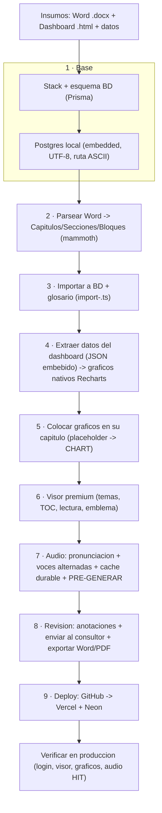

# PLAYBOOK — De cero a un informe interactivo en producción

> **⚠️ PROCESO CANÓNICO ACTUALIZADO → ver `GENERACION.md`.** Hoy un informe se arma
> (o corrige) con **un solo comando** (`scripts/generar-informe.ts`) desde una carpeta
> declarativa (docx + `graficos.json` + `mapas.json` + `figuras/`), usando el **número
> de pie "Figura X-Y"** como llave. **Ya NO se raspa el dashboard HTML** (era frágil:
> duplicó un mapa, eligió mal una variable). Este PLAYBOOK conserva el **detalle
> histórico**, el **stack**, y la **tabla de trampas** (sigue vigente y creciendo).

Rastro completo del proceso, los errores encontrados y los cuidados. Insumos de
partida hoy: un **Word (`.docx`)** + los **datos de cada gráfico/mapa como archivos**
(no el dashboard).

---

## Diagrama de flujo



---

## Fases detalladas

### Fase 0 · Arquitectura y esquema
- Stack: **Next.js 15 (App Router) · TypeScript · Prisma + PostgreSQL · Auth.js v5 · Tailwind · Recharts**.
- Modelo de datos: `User · Report · Chapter · Section · Block · Annotation · AnnotationReply · ReportAssignment · GlossaryTerm · AudioAsset`.
- **Auth.js dividido**: `src/lib/auth.config.ts` (Edge-safe, sin Prisma → lo usa el middleware) + `src/lib/auth.ts` (Node, con Credentials/Prisma).
- RBAC server-side en `src/lib/rbac.ts` (CONSULTOR edita, REVISOR comenta).

### Fase 1 · Base de datos local (sin Docker)
- `npm run db:local` → PostgreSQL embebido (`scripts/pg.mjs`).
- **Cluster en `~/.informes-pgdata` (ruta ASCII)** y **base en UTF-8 desde `template0`**.
- `.env` con `DATABASE_URL` + `AUTH_SECRET`; `npx prisma db push`; seed.

### Fase 2 · Parseo del Word
- `src/lib/docx.ts` (**mammoth** + **node-html-parser**): `h1`→Capítulo · `h2`→Sección ·
  `h3-h6`→HEADING · `p`→PARAGRAPH · `table`→TABLE · `ul/ol`→viñetas · `img`→placeholder de figura (sin bytes).

### Fase 3 · Importar el informe + glosario
- Script `scripts/import-<caso>.ts`: crea el `Report` con capítulos/secciones/bloques y
  el **glosario** (término + definición + **pronunciación** para la narración).

### Fase 4 · Gráficos interactivos desde el dashboard
- El dashboard autocontenido trae los datos como **JSON embebido**
  `{"id","tipo","titulo","labels","data"/"series"/"serie_barra"/"serie_linea",...}`.
- Extraerlos con **emparejamiento de llaves**: buscar `"tipo":`, retroceder con
  `lastIndexOf("{")`, avanzar contando llaves (respetando strings) y `JSON.parse`.
- `src/components/report/DashboardChart.tsx` renderiza cada tipo con Recharts
  (dona→pie, barras, barras_apiladas→stacked, barras_h→horizontal, barras_linea→ComposedChart dual-axis, linea).
- `scripts/place-dashboard-charts.mjs [neon]`: mapea **título del gráfico → capítulo**
  por palabra clave y convierte el 1er placeholder IMAGE en un `CHART` con `content={_dash:true,...}`. Idempotente.

### Fase 5 · Visor premium
- Fuentes **Inter + Source Serif 4** (`next/font`); tokens sobrios (papel gris, tarjetas
  blancas, sombras suaves, radios 14px, acento navy) para claro/oscuro/sepia.
- Cabecera compacta con **emblema**; TOC (**N1/N2**, hover-expand, activo); ancho de lectura ~700px; acento por capítulo.

### Fase 6 · Audio (ElevenLabs)
- API key con scopes: **Text-to-Speech**, **Diccionarios de pronunciación (escribir)**, Voces (leer).
- `.env`: `ELEVENLABS_API_KEY`, `ELEVENLABS_VOICE_ID`, `ELEVENLABS_MODEL`, `ELEVENLABS_CONCURRENCY=2`.
- **Pronunciación**: diccionario de ElevenLabs generado desde el glosario (`add-from-rules`); su versión entra en la clave de caché.
- **Voces alternadas** mujer/hombre por segmento (`synthesizeAlternating`) con **límite de concurrencia**.
- **Caché durable en la base** (`AudioAsset.data` Bytes) → se genera una vez, no re-gasta.
- **Pre-generar** todo: `npx tsx scripts/pregenerate-audio.ts [neon]` → cada reproducción es HIT instantáneo.

### Fase 7 · Revisión y exportación
- Anotaciones contextuales (teclado y voz), consolidador por capítulo.
- **Enviar al consultor** (`ReportAssignment.submittedAt`) con confirmación.
- **Exportar** Word (.doc) y PDF (impresión).

### Fase 8 · Despliegue
- `git init` → repo GitHub. Secretos (`.env*`, `Insumos/`, `.audio-cache`) en `.gitignore`.
- Producción: `trustHost`, audio a `AudioAsset` (no disco), Prisma `binaryTargets=["native","rhel-openssl-3.0.x"]`.
- **Neon** (Postgres nube): `scripts/migrate-neon.mjs` (esquema+seed+import). Para cambios de esquema: `prisma db push` contra Neon **antes** de desplegar el código.
- **Vercel**: importar repo, variables de entorno (`DATABASE_URL` Neon, `AUTH_SECRET`, `ELEVENLABS_*`), deploy. Auto-deploy en cada push.
- **Antes de cada push**: `npm run build` local (evita deploys fallidos).

---

## ⚠️ Trampas conocidas (y cómo evitarlas)

| # | Síntoma | Causa | Solución |
|---|---|---|---|
| 1 | `initdb` falla en UTF-8 | Ruta del proyecto con acentos ("Análisis") | Cluster en ruta **ASCII** (`~/.informes-pgdata`) |
| 2 | `0xe2 0x86 0x92 ... has no equivalent in WIN1252` | Base en WIN1252 no admite `→` | Crear base **UTF-8** desde `template0` |
| 3 | Dev server cae al compilar | `require()` en `tailwind.config.ts` (ESM) | Usar `import` |
| 4 | Build/deploy falla en middleware | Auth.js con Prisma corre en **Edge** | Separar `auth.config.ts` (Edge-safe) |
| 5 | `useSearchParams() should be wrapped in a suspense boundary` | Prerender de prod | Envolver en `<Suspense>` |
| 6 | Scripts escriben a la base equivocada | `process.loadEnvFile` **no sobrescribe** env ya definido | Leer `DATABASE_URL` del archivo y pasarla **explícita** a `new PrismaClient({datasources:{db:{url}}})` |
| 7 | `Buffer no asignable a Bytes` | Prisma `Bytes` = `Uint8Array` | `new Uint8Array(buffer)` |
| 8 | Audio corta / `429 concurrent_limit_exceeded` | Todos los segmentos en paralelo | **Limitar concurrencia** (2) |
| 9 | Audio se regenera y re-gasta | Disco efímero en serverless | Guardar el mp3 **en la base** |
| 10 | Lag al reproducir | Genera al momento / descarga completa | **Pre-generar** + reproducción progresiva (`audio.src` directo) |
| 11 | `git commit -m @'...'@` no commitea | Here-string dentro de `if {}` en PowerShell | Usar `-m "..." -m "..."` |
| 12 | Función de audio se corta en Vercel | Timeout serverless | `export const maxDuration = 60` |
| 13 | **Re-subir un docx corregido borra las observaciones** | El modo CREAR hace `deleteMany` por slug (borra+recrea → cascada borra anotaciones/versiones/audio) | Usar **`--actualizar`**: actualiza en su lugar, preserva `blockId`, registra versión y re-ancla |
| 14 | `pregenerate-audio` no genera el 2° informe | Tenía el **slug hardcodeado** (Talca) | Ahora toma slug: `npx tsx scripts/pregenerate-audio.ts <slug> [neon]` |
| 15 | Un revisor abre un estudio no asignado por URL | `getReportAccess` caía al rol global | Visibilidad por **asignación explícita** (`ReportAssignment`); sin ella no hay acceso salvo ADMIN |
| 16 | Voz de la intro con acento de España / se re-gastaba | Voz del navegador variable + no cacheada | Intro = ElevenLabs **cacheado** (voz `ELEVENLABS_INTRO_VOICE_ID`) con timestamps para el resaltado |
| 17 | Observaciones quedan huérfanas tras corregir | Se reordenaron/insertaron capítulos en medio (emparejamiento por posición) | Para reestructuras grandes, editar en el editor web; las huérfanas se marcan, no se pierden |

---

## 🚀 Receta rápida (motor único — detalle en `GENERACION.md`)

```bash
# --- INFORME NUEVO ---
# 0. Arma la carpeta declarativa (copia plantilla_informe/): informe.json + informe.docx
#    + graficos.json (o CSV → node scripts/csv-a-graficos.mjs <carpeta>) + mapas.json + geo/ + figuras/
# 1. Local
npm run db:local                                  # (otra terminal) Postgres embebido
npm run db:push && npm run db:seed
npx tsx scripts/generar-informe.ts <carpeta>      # docx + gráficos + mapas + figuras + versión 1.0
npx tsx scripts/pregenerate-audio.ts <slug>         # audio (opcional en local; cuesta créditos)
npm run build                                      # verificar antes de subir
# 2. Producción (Neon + Vercel)
npx prisma db push                                # solo si cambió el esquema (contra Neon; ver .env.production.local)
npx tsx scripts/generar-informe.ts <carpeta> neon
npx tsx scripts/pregenerate-audio.ts <slug> neon
node scripts/pregenerate-intro.ts <slug> neon     # audio del resumen ejecutivo (si tiene execSummary)
git add -A && git commit -m "..." && git push     # Vercel despliega solo
# 3. Acceso: entra como admin (/admin) y habilita el estudio a los revisores/consultores.

# --- CORREGIR UN INFORME EXISTENTE (nueva versión, preserva observaciones) ---
npx tsx scripts/generar-informe.ts <carpeta> neon --actualizar
npx tsx scripts/pregenerate-audio.ts <slug> neon    # regenera solo los capítulos cambiados
```

> **Estado:** el motor `generar-informe.ts` ya es genérico (crear y actualizar).
> Pendiente menor: generalizar las **capas de punto** de mapas (hoy reconoce
> `siniestros`/`colegios`) y la **UI del toggle de bloqueo** de secciones en el editor.
